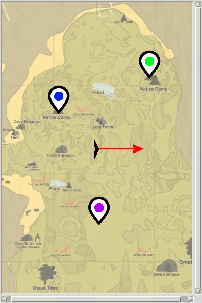
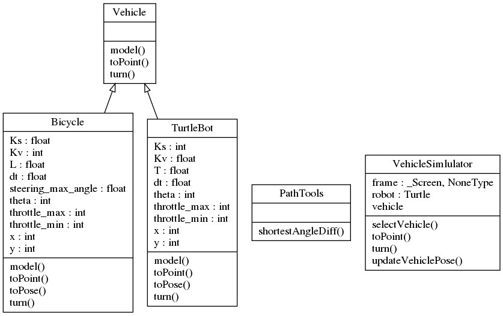

# Installation et première execution

Une fois pour toutes:  
```bash
git clone git@github.com:m0rph03nix/RobMob_VehicleSimulator_student.git
cd RobMob_VehicleSimulator_student
virtualenv venv --python=/usr/bin/python3
pip install -r requirements.txt
# si virtualenv pas installé, faire : sudo apt-get install virtualenv
```

A chaque chargement du projet dans un nouveau terminal (dans RobMob_VehicleSimulator_student):
```bash
# dans le répertoire du projet faites :
source venv/bin/activate
```

Vous pouvez executer le code d'exemple `scenario.py`  
```bash
# dans le répertoire du projet faites :
python scenario.py
```

qui lance l'interface suivante:  




# Description

`VehicleSimulator.py` permet de charger des modèles de véhicule et leur modes de déplacement, et de les afficher au travers du simulateur `Turtle`  

Dans le dossier `vehicles`, `Vehicle.py` décrit la classe abstraite d'un véhicule avec ses fonctions imposées:
- `model` : modèle du véhicule
- `toPoint` : pilotage du véhicule vers un point (x,y)
- `turn` : tourner d'un certain angle

L'exemple du vélo (voiture simplifiée) est fournie dans `Bicycle.py`


  


# Travail à réaliser

Sur la base de l'exemple `Bicycle.py`, créez `TurtleBot.py` contenant le model d'un robot à roues différentiels tel que le [Turtlebot](https://clearpathrobotics.com/turtlebot-2-open-source-robot/)

Renseignez l'ensemble des fonctions de la classe abstraite jusqu'à obtenir un fonctionnement optimal.

Faites valider par le prof


